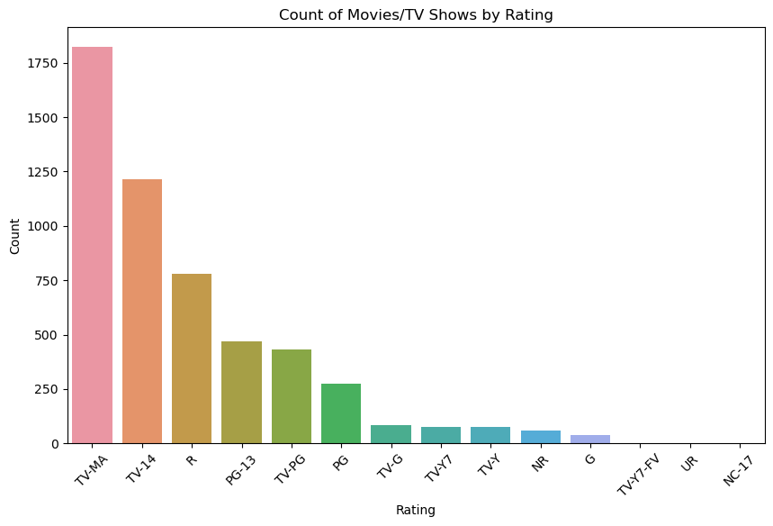
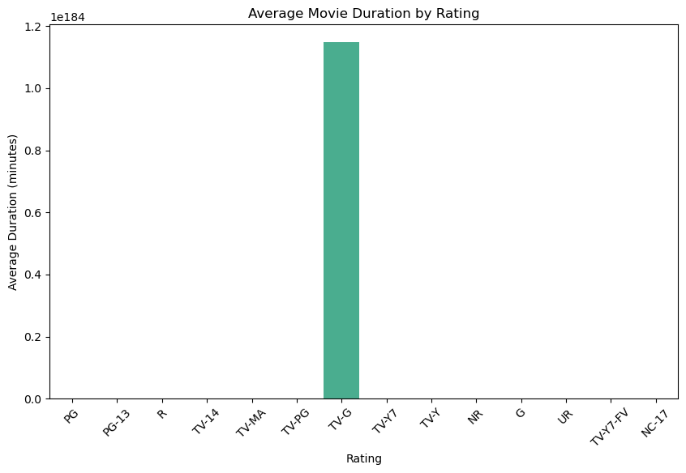
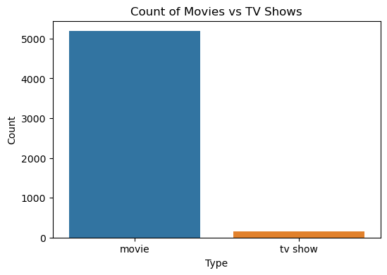

# DATA_ANALYSIS_TASK_1
Data cleaning and preprocessing of a raw movie dataset from Kaggle using Python

# 🎬 Movie Dataset - Data Cleaning & Preprocessing

This project involves cleaning and preprocessing a raw movie dataset from Kaggle using Python (Pandas). The goal is to handle missing values, remove duplicates, standardize formats, and prepare the dataset for further analysis or visualization.

---

## 📁 Dataset

- **Source**: Kaggle (Netflix Movies and TV Shows Dataset)
- **Total Rows**: 8807
- **Total Columns**: 12

---

## 🛠️ Tools Used

- Python (Pandas)
- Jupyter Notebook
- Microsoft Excel (optional cleanup and verification)

---

## ✅ Cleaning Steps Performed

1. **Handled Missing Values**
   - Filled missing values in `director`, `cast`, and `country` with `"Unknown"`.
   - Checked for missing values in other columns using `.isnull()`.

2. **Removed Duplicates**
   - Removed duplicate rows using `.drop_duplicates()`.

3. **Standardized Text Formats**
   - Cleaned `country` names using `.str.lower().str.strip()`.
   - Trimmed white spaces from `rating`.

4. **Converted Date Format**
   - Converted `date_added` to `datetime64[ns]` format using `pd.to_datetime()`.

5. **Split Duration Column**
   - Extracted numerical duration and type (e.g., "88 min", "1 Season") into separate columns:
     - `duration_int`
     - `duration_type`

6. **Verified and Fixed Data Types**
   - Ensured `release_year` is integer and `date_added` is datetime.

---

## 📊 Results and Insights

### 1. Count of Movies/TV Shows by Rating

- The most frequent rating is **TV-MA**, followed by **TV-14** and **R**.
- This indicates a dominance of mature content on the platform.

### 2. Average Movie Duration by Rating

- The bar for **TV-G** appeared unusually high due to inconsistent values or outliers. Requires further inspection.
- Other ratings had average durations within typical feature-length ranges.

### 3. Count of Movies vs TV Shows

- **Movies** significantly outnumber **TV Shows** in the dataset, indicating a content-heavy focus on movies.

---

## 📄 Files Included

- `Data Cleaning and Preprocessing.ipynb` – Jupyter Notebook with full code.
- `netflix_titles.csv` - Raw movie dataset.
- `cleaned_netflix_dataset.csv` – Final cleaned dataset.
- `README.md` – Project summary and documentation.

---

## 📌 Summary

The dataset was cleaned and standardized successfully to prepare it for further EDA, visualization, or modeling tasks. It now contains no null values in critical fields, consistent date and text formatting, and separated components for better analysis.

---

## 🔗 References

- [Kaggle: Netflix Movies and TV Shows Dataset](https://www.kaggle.com/datasets/shivamb/netflix-shows)
